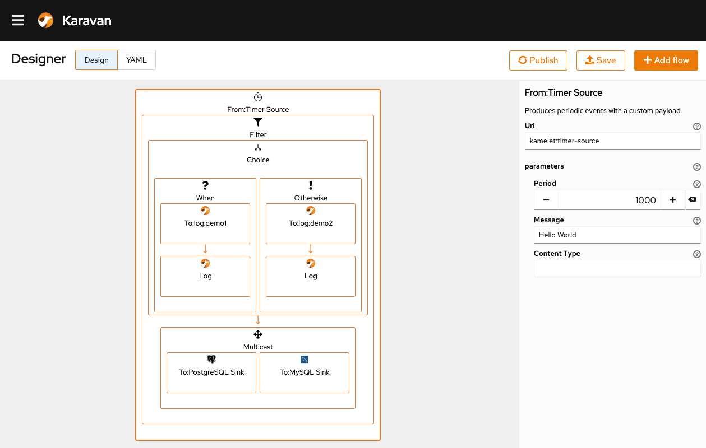

# Karavan
Integration Designer for Apache Camel



## Running the application in dev mode
You can run your application in dev mode that enables live coding using:
### Backend
```shell script
cd karavan
mvn compile quarkus:dev
```
### Frontend
```shell script
cd karavan/src/main/webapp/
npm start
```
### Generate Typescript models, API and Kamelets
```shell
mvn clean compile exec:java -Dexec.mainClass="org.apache.camel.karavan.generator.KaravanGenerator" -f generator
```

## Packaging and running in local mode
### Packaging 
The application can be packaged using:
```shell script
cd karavan
mvn clean package -Dquarkus.container-image.build=true
```

### Run 
```shell script
docker run -it -p 8080:8080 -e KARAVAN_MODE=local -v $(pwd):/deployments/integrations  entropy1/karavan
```
For SELunux
```shell script
docker run -it -p 8080:8080 -e KARAVAN_MODE=local -v $(pwd):/deployments/integrations:z  entropy1/karavan
```

## Packaging and running in local mode (native)
### Build native
```shell
DOCKER_BUILDKIT=1 docker build -f karavan/src/main/docker/Dockerfile.multistage -t entropy1/karavan-native .
```
### Run
```shell script
docker run -it -p 8080:8080 -e KARAVAN_MODE=local -v $(pwd):/deployments/integrations  entropy1/karavan-native
```
For SELunux
```shell script
docker run -it -p 8080:8080 -e KARAVAN_MODE=local -v $(pwd):/deployments/integrations:z  entropy1/karavan-native
```

## Running in cloud mode


[Karavan demo on Openshift](openshift/README.md)